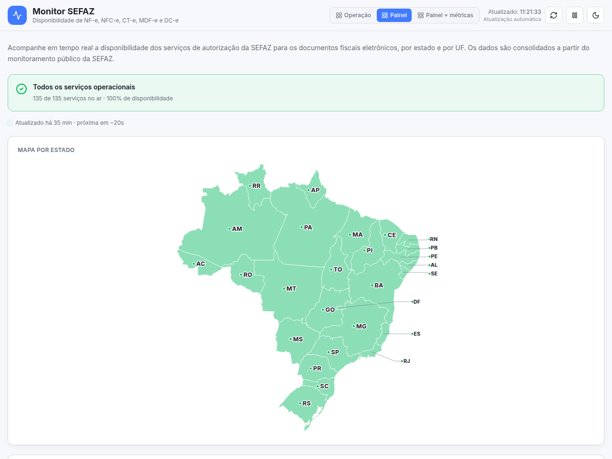

# Monitor SEFAZ

Status page da disponibilidade dos webservices da SEFAZ para os documentos
fiscais eletrônicos brasileiros — **NF-e, NFC-e, CT-e, MDF-e e DC-e, nas 27 UFs**.
Cruza fontes públicas por consenso, mostra o histórico de uptime num dashboard e
avisa quando algo cai. Open-source, independente, sem afiliação com a SEFAZ ou a
Receita Federal.

**→ [Acesse o monitor online](https://felipesauer.github.io/monitor-sefaz/)**

## Destaques

- **135 serviços monitorados** — os 5 documentos × 27 UFs, resolvendo sozinho qual
  autorizador atende cada estado (próprio, SVRS, SVAN, Ambiente Nacional…).
- **Consenso multi-fonte** — cruza três fontes com precedência para as oficiais, em
  vez de depender de uma só; se uma cai, as outras sustentam.
- **Notificações multicanal** — Discord, Slack, Telegram ou webhook quando um serviço
  cai/volta, entra em contingência, ou sai uma Nota Técnica.
- **Detecção de drift** — sinaliza quando uma fonte oficial fica inconsistente (o
  portal mudou o HTML), em vez de mascarar silenciosamente.
- **Zero-infra por padrão** — roda como site 100% estático no GitHub Pages; sem
  banco, sem servidor, sem certificado.

## O que ele monitora

Os cinco documentos fiscais eletrônicos, nas 27 UFs — **135 serviços** no total:

- NF-e — Nota Fiscal Eletrônica (modelo 55)
- NFC-e — Nota Fiscal de Consumidor Eletrônica (modelo 65)
- CT-e — Conhecimento de Transporte Eletrônico
- MDF-e — Manifesto Eletrônico de Documentos Fiscais
- DC-e — Declaração de Conteúdo eletrônica

Cada serviço é classificado em um de cinco estados:

| Estado | Significado |
|---|---|
| **Operacional** | Serviço em operação (cStat 107). |
| **Contingência** | Operando por ambiente de contingência (SVC) — ainda dá para emitir. |
| **Instável** | Paralisação momentânea / lentidão (cStat 108). |
| **Indisponível** | Paralisação sem previsão (cStat 109). |
| **Sem dados** | Não foi possível ler o status naquele momento. |

Também acompanha as **Notas Técnicas** publicadas no portal da NF-e, exibidas no
dashboard.

## Como obtém os dados

O modo padrão **não exige certificado digital**. O monitor cruza fontes públicas
por consenso, com precedência para as oficiais:

1. **SVRS** — portal de disponibilidade do SVRS (oficial).
2. **Receita** — página de disponibilidade da NF-e/CT-e (oficial).
3. **IntegraNotas** — API pública (não-oficial), mais completa.

As duas fontes oficiais decidem o estado de cada serviço; o IntegraNotas preenche
as UFs e documentos que elas não publicam. MDF-e e DC-e são centralizados no SVRS,
então derivam do estado desse autorizador. Uma fonte que falha não derruba as
demais, e há um **piso de cobertura (75%)** abaixo do qual a coleta é considerada
degradada e não é publicada — evitando exibir "tudo no ar" por engano.

Cada coleta mede a **cobertura por fonte** e marca quando uma fonte oficial fica
degradada (cobertura abaixo do piso) — o sinal que distingue "a fonte parou de
responder / mudou o HTML" de "o serviço da SEFAZ caiu".

A consulta SOAP direta aos webservices (modo `soap`) fornece dados mais ricos, mas
exige saída de rede e, em vários autorizadores, um certificado A1 (mTLS). É
opcional e desativada por padrão.

## Notificações

Opcionalmente, o monitor alerta quando o estado muda. Cada canal só é ativado
quando suas variáveis de ambiente existem; **sem nenhuma configuração, a
notificação fica desligada** e o pipeline segue idêntico.

Eventos:

| Evento | Quando dispara |
|---|---|
| `SERVICE_DOWN` / `SERVICE_RECOVERED` | Um serviço saiu / voltou ao ar. |
| `CONTINGENCY_ENTERED` / `CONTINGENCY_EXITED` | Entrou / saiu de contingência (SVC). |
| `TECHNICAL_NOTE` | Nova Nota Técnica publicada no portal. |
| `SOURCE_DEGRADED` | Uma fonte oficial ficou degradada (drift). |
| `DAILY_DIGEST` | Resumo diário de saúde (opcional, por hora configurável). |

Canais: **Discord**, **Slack**, **Telegram** e **webhook genérico** (recebe o
evento como JSON cru). As variáveis (`NOTIFY_DISCORD_WEBHOOK_URL`,
`NOTIFY_SLACK_WEBHOOK_URL`, `NOTIFY_TELEGRAM_BOT_TOKEN` + `NOTIFY_TELEGRAM_CHAT_ID`,
`NOTIFY_WEBHOOK_URL`, `NOTIFY_EVENTS`, `NOTIFY_DIGEST_HOUR`) estão documentadas em
[`.env.example`](.env.example). Funciona tanto no caminho estático (via GitHub
Actions) quanto no self-host (API).

## Dashboard

- **Mapa do Brasil** clicável, cada UF colorida pelo pior estado agregado.
- **Cards por serviço** com badge de estado, tempo de resposta e *sparkline* de latência.
- **Histórico de uptime** (24h/72h) com barra estilo status-page e gráfico de latência.
- **Filtros** por documento e por UF; **banner** de saúde geral.
- **Três modos de layout** (Operação, Painel, Painel + métricas) e **tema claro/escuro**.
- **Últimas Notas Técnicas** e um FAQ explicando cStat, autorizadores e contingência.

## API HTTP

No modo self-host, a API expõe (base `/api/v1`):

| Método | Rota | Retorna |
|---|---|---|
| GET | `/health` | `{ status: 'ok' }` |
| GET | `/status` | Snapshot atual; filtros `?document=&uf=&env=` |
| GET | `/status/:document/:uf` | Status de um serviço específico |
| GET | `/summary` | Agregado: disponibilidade, no ar, com problema, latência média, por documento e por autorizador |
| GET | `/services/:id/history` | Série histórica (`?period=24h\|72h`) |
| GET | `/services/:id/uptime` | Uptime %, total de checagens, latência média |
| GET | `/incidents` | Incidentes derivados da série |
| GET | `/stream` | **SSE** — deltas de mudança de estado em tempo real |

O Cloudflare Worker expõe um subconjunto ao vivo (`/summary`, `/health` e o
snapshot completo).

## Uso

A forma mais simples é acessar o site publicado. Os dados são atualizados de hora
em hora por um GitHub Actions (a granularidade sub-horária não é honrada de forma
confiável pelo agendador do GitHub).

Para rodar localmente é necessário Node 20+ e pnpm.

    pnpm install

    # Gera os arquivos de status consultando as fontes públicas
    pnpm --filter @monitor-sefaz/collector collect ./apps/web/public/data

    # Sobe o dashboard em http://localhost:5173
    pnpm --filter @monitor-sefaz/web dev

## Deploy

O mesmo motor de coleta alimenta três formas de rodar:

**SPA estática (GitHub Pages).** Um GitHub Actions coleta e versiona os JSONs; a SPA
apenas os lê. Não requer infraestrutura.

**Cloudflare Worker.** O Worker faz a coleta ao vivo com CORS e a SPA o consome.

    pnpm --filter @monitor-sefaz/worker deploy   # requer wrangler login

**Self-host.** API Fastify com Redis, scheduler e SSE, servindo o dashboard. É o
único modo com histórico persistido, tempo real e suporte ao modo SOAP+A1.

    docker compose up --build   # http://localhost:3333

## Configuração

O front escolhe a fonte de dados por variável de ambiente: com `VITE_API_BASE_URL`
definida consome a API/Worker ao vivo; vazia, lê os JSONs estáticos.

A API self-host lê as variáveis de um `.env` na raiz (veja [`.env.example`](.env.example)):

- `STATUS_SOURCE` — `hybrid` (consenso multi-fonte, padrão), `availability` (só a
  página oficial) ou `soap` (consulta SOAP direta)
- `REDIS_URL` — conexão com o Redis
- `SEFAZ_CERT_PATH` / `SEFAZ_CERT_PASSPHRASE` — certificado A1 (.pfx) para o modo `soap`
- `CRON_EXPRESSION`, `SEFAZ_TIMEOUT_MS`, `SEFAZ_CONCURRENCY`, `HISTORY_RETENTION_MS`, `RATE_LIMIT_MAX`
- `NOTIFY_*` — canais de notificação (ver seção acima)

Homologação não aparece: a página pública da SEFAZ cobre apenas produção, e o
ambiente de homologação só é alcançável pelo modo `soap`.

## Arquitetura

Monorepo TypeScript (strict) gerenciado com pnpm e Turborepo.

    packages/catalog     UFs, cStat, endpoints e o mapa UF -> autorizador
    packages/core        motor de coleta: consenso multi-fonte, SOAP e notas técnicas
    packages/contracts   schemas Zod e DTOs compartilhados
    packages/notifier    detecção de transições e canais de notificação
    apps/collector       CLI que gera os JSONs versionados (GitHub Actions)
    apps/worker          Cloudflare Worker de coleta ao vivo
    apps/api             API Fastify self-host: scheduler, REST, SSE e Redis
    apps/web             dashboard React + Vite

Os três caminhos (collector, worker e API) usam o **mesmo** motor de consenso e o
**mesmo** piso de cobertura, para os números baterem entre as pontas.

Comandos, a partir da raiz:

    pnpm build        builda todos os pacotes e apps
    pnpm dev          sobe os apps em modo desenvolvimento
    pnpm test         roda os testes (Vitest)
    pnpm typecheck    checagem de tipos
    pnpm lint         ESLint

São **214 testes** (Vitest), com as respostas da SEFAZ mockadas por fixtures em
`packages/core/test` — os testes nunca dependem da rede. O CI roda lint, typecheck
e testes em cada pull request; um workflow separado e não-bloqueante faz uma coleta
ao vivo periódica e alerta se uma fonte oficial degradar, capturando o drift do
portal que as fixtures estáticas não pegam.

## Referências

Portais oficiais de disponibilidade e fontes que o monitor consome:

- [Portal Nacional da NF-e — Disponibilidade](https://www.nfe.fazenda.gov.br/portal/disponibilidade.aspx)
- [Portal Nacional do CT-e — Disponibilidade](https://www.cte.fazenda.gov.br/portal/disponibilidade.aspx)
- [Portal de Documentos Fiscais Eletrônicos do SVRS](https://dfe-portal.svrs.rs.gov.br)
- [IntegraNotas — Monitor SEFAZ](https://integranotas.com.br/doc/sefaz/monitor)

## Contribuindo

Contribuições são bem-vindas. O fluxo de desenvolvimento, os padrões de código e o
passo a passo para adicionar um documento ou autorizador estão em
[CONTRIBUTING.md](CONTRIBUTING.md). Para relatar uma falha de segurança, veja
[SECURITY.md](SECURITY.md).

## Licença

[MIT](LICENSE) © Felipe Sauer
